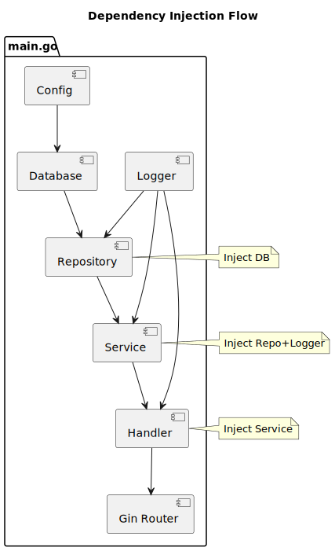
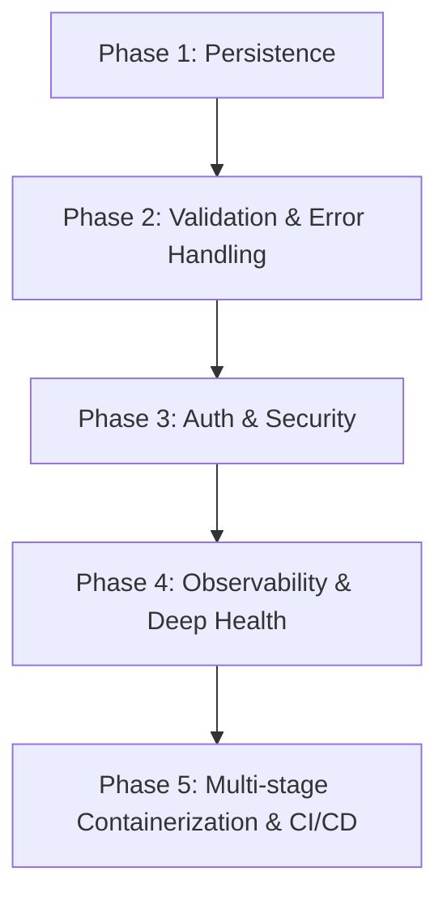

# Go Microservice Boilerplate

A production-ready, high-performance boilerplate Go microservice API built using the [Gin Web Framework](https://github.com/gin-gonic/gin) and [Zap logger](https://github.com/uber-go/zap). This boilerplate is designed around industry-standard software design patterns, Clean Architecture principles, and strict separation of concerns to provide an excellent starting point for building scalable backend services.

---

## 🏗️ Architecture & Dependency Injection

The project adheres to a clean, layered architecture structure where dependencies flow inward:

```
[HTTP Request] ──> [Gin Router] ──> [Handlers] ──> [Services] ──> [Repositories] ──> [Database/External APIs]
```

### Dependency Injection Flow

Dependencies are initialized sequentially in [main.go](file:///home/ubuntu/code/github/raviautopilot/rlib/cmd/api/main.go) and injected down the stack, which isolates layers and simplifies testing.



---

## 📁 Project Structure

Below is the directory structure of the repository. Click on any file to open it directly in the editor:

```text
rlib/
├── .github/                      # GitHub Actions workflows & config
├── cmd/
│   └── api/
│       └── main.go               # Application entrypoint & Dependency Injection
├── docs/                         # Swagger / OpenAPI API documentation
│   ├── docs.go
│   ├── swagger.json
│   └── swagger.yaml
├── internal/                     # Private application packages
│   ├── config/
│   │   └── config.go             # Viper configuration loader
│   ├── handler/
│   │   └── health.go             # HTTP handlers (endpoints)
│   ├── logger/
│   │   └── logger.go             # Structured Zap logger & middleware
│   ├── router/
│   │   └── router.go             # Route registration & Gin engine setup
│   └── service/
│       └── health.go             # Business logic layer (services)
├── user-docs/
│   └── diagrarms/                # Architecture diagrams (PlantUML / SVG)
├── config.json                   # Configuration parameters
├── go.mod                        # Go module dependencies declaration
├── go.sum                        # Go module checksum security file
└── manage.sh                     # Helper shell script for managing the application lifecycle
```

### Component Details

- **Entrypoint**: [cmd/api/main.go](file:///home/ubuntu/code/github/raviautopilot/rlib/cmd/api/main.go) orchestrates loading configs, initializing logging, wiring dependencies, routing requests, and launching the server with graceful shutdown.
- **Config**: [internal/config/config.go](file:///home/ubuntu/code/github/raviautopilot/rlib/internal/config/config.go) reads parameters from [config.json](file:///home/ubuntu/code/github/raviautopilot/rlib/config.json) and merges them with env variables using Viper.
- **Handlers**: [internal/handler/health.go](file:///home/ubuntu/code/github/raviautopilot/rlib/internal/handler/health.go) binds incoming JSON payloads, handles route validation, maps service responses to HTTP, and writes JSON replies.
- **Services**: [internal/service/health.go](file:///home/ubuntu/code/github/raviautopilot/rlib/internal/service/health.go) holds the core business rules and interacts with repository layers.
- **Router**: [internal/router/router.go](file:///home/ubuntu/code/github/raviautopilot/rlib/internal/router/router.go) constructs the Gin engine, registers endpoints, and wires logger and recovery middlewares.
- **Logger**: [internal/logger/logger.go](file:///home/ubuntu/code/github/raviautopilot/rlib/internal/logger/logger.go) handles structured logging via Uber Zap and provides interceptors to catch panics and format standard error traces.

---

## 🛠️ Getting Started & Lifecycle Management

A helper script, [manage.sh](file:///home/ubuntu/code/github/raviautopilot/rlib/manage.sh), is provided to streamline common development and production tasks.

### Common Commands

| Command | Description |
| :--- | :--- |
| `./manage.sh build` | Generates Swagger specs and compiles the Go binary to `bin/api` |
| `./manage.sh start` | Starts the application in the background (detaches process) |
| `./manage.sh status`| Displays the running process status (CPU, memory, PID) |
| `./manage.sh stop`  | Sends a graceful `SIGTERM` signal to let the server drain active requests |
| `./manage.sh kill`  | Forces immediate termination using a `SIGKILL` signal |
| `./manage.sh logs`  | Prints the last 50 lines of logs. Add `-f` or `--follow` to tail in real-time |
| `./manage.sh errors`| Filters and highlights any `ERROR`, `FATAL`, or `PANIC` records from the log |
| `./manage.sh troubleshoot` | Inspects system sockets on port 1700 and outputs telemetry logs |
| `./manage.sh clean` | Cleans up builds, logs, and process descriptors |

---

## 💎 Fundamental Software Engineering Principles

To maintain a high-quality codebase, we follow these core software engineering principles:

### 1. Separation of Concerns (SoC) & Clean Architecture
Each layer has one responsibility:
- **HTTP Transport**: Handles routing, raw parameters, validation, and JSON serialization. Does not evaluate business logic.
- **Business Domain**: Encapsulates workflows, domain entities, validations, and logic rules. Completely decoupled from transport implementation details.
- **Data Access (Planned)**: Accesses databases, caches, and third-party APIs. Implements mockable repositories.

### 2. Dependency Inversion Principle (DIP)
High-level modules do not depend directly on low-level modules; both depend on abstractions (interfaces).
- Handlers depend on the [HealthService](file:///home/ubuntu/code/github/raviautopilot/rlib/internal/service/health.go#L17) interface, not the concrete [healthService](file:///home/ubuntu/code/github/raviautopilot/rlib/internal/service/health.go#L21) struct.
- This decoupling allows you to mock the entire service layer during unit testing without spinning up HTTP servers.

### 3. Graceful Shutdown & Reliability
Server operations should never quit abruptly. Our handler implementation in [main.go](file:///home/ubuntu/code/github/raviautopilot/rlib/cmd/api/main.go#L95) blocks on system signals (SIGINT, SIGTERM). When triggered:
1. It stops accepting new requests.
2. It allows ongoing requests 5 seconds to finish processing before forced termination.
3. This guarantees database transactions finish and connection pools are closed properly.

### 4. Structured & Levelled Logging
Println is avoided. We use Uber Zap to provide:
- Structured output (JSON format in production for easy parsing by ELK/Splunk/Datadog).
- Distinct levels (`DEBUG`, `INFO`, `WARN`, `ERROR`, `PANIC`, `FATAL`).
- Middleware integration ([logger.GinZap](file:///home/ubuntu/code/github/raviautopilot/rlib/internal/logger/logger.go#L42)) to automatically capture IP, latency, routes, and user agents.

### 5. Automated API Documentation
The API is self-documenting. By using declarative Swagger annotations, we generate schemas and interactive playgrounds automatically. Serve the running app and visit `http://localhost:1700/swagger/index.html` to explore endpoints.

---

## 📈 Enhancement Path

To guide the evolution of this template into a robust production-grade system, follow this step-by-step enhancement roadmap:



### Phase 1: Database Persistence Layer
- **Objective**: Introduce a robust data store.
- **Tasks**:
  1. Integrate an ORM or driver (e.g., [GORM](https://gorm.io) or [pgx](https://github.com/jackc/pgx) for PostgreSQL).
  2. Implement a `repository` layer under `internal/repository` to separate raw SQL queries from services.
  3. Wire database connections inside [main.go](file:///home/ubuntu/code/github/raviautopilot/rlib/cmd/api/main.go) and pass them as dependencies to repositories.

### Phase 2: Input Validation & Standardized Errors
- **Objective**: Secure entrypoints and standardize REST API error responses.
- **Tasks**:
  1. Leverage `github.com/go-playground/validator/v10` on incoming request binding structs.
  2. Implement an error handling middleware that captures custom domain errors (e.g., `ErrNotFound`, `ErrInvalidInput`) and translates them to HTTP standard statuses.
  3. Standardize error JSON shapes: `{"error": "string", "details": []}`.

### Phase 3: Authentication & Security Controls
- **Objective**: Protect resources and limit misuse.
- **Tasks**:
  1. Add an authentication middleware to verify JWTs or session tokens.
  2. Introduce CORS configurations via `github.com/gin-contrib/cors` to secure browser clients.
  3. Integrate token-bucket rate limiting (e.g., using `golang.org/x/time/rate`) to throttle requests.

### Phase 4: Production Observability & Deeper Metrics
- **Objective**: Achieve high visibility into the system's runtime health.
- **Tasks**:
  1. Expose Prometheus metrics under `/metrics` via `github.com/prometheus/client_golang/prometheus/promhttp`.
  2. Instrument tracing using OpenTelemetry (OTel) to trace database latency and handler operations.
  3. Expand the [CheckHealth](file:///home/ubuntu/code/github/raviautopilot/rlib/internal/service/health.go#L35) business logic to perform active pings to PostgreSQL, Redis, and disk space.

### Phase 5: Containerization & Deployment Pipelines
- **Objective**: Automate testing and shipping.
- **Tasks**:
  1. Write a multi-stage `Dockerfile` to build an extremely light static Go binary run from `scratch` or `alpine`.
  2. Create a `docker-compose.yaml` spinning up the service alongside PostgreSQL and local logging nodes.
  3. Configure a GitHub Actions workflow that executes `golangci-lint`, runs unit tests with `-cover`, and publishes the Docker image.