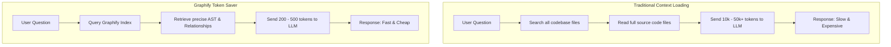

# 📊 Graphify Token Saver Guide

This guide explains how **Graphify** optimizes your development workflow with Antigravity, what benefits it brings, how to use the combined helper script, and how to verify your token savings.

---

## 🛠️ What is Graphify?

When working with large codebases, AI assistants typically search for code by reading entire files or performing brute-force grepping. This consumes a massive amount of context (tokens), leading to high costs, slower response times, and potential model distraction.

**Graphify** solves this by parsing your codebase into a structured **Semantic Knowledge Graph** (`graphify-out/graph.json`). Instead of sending full source files, the assistant queries the graph to retrieve only the relevant Abstract Syntax Tree (AST) nodes, relationships, and import graphs.

### 🔄 Workflow Comparison



---

## 🚀 Key Benefits

| Feature | Traditional File Loading | Graphify-Enabled | Improvement |
| :--- | :--- | :--- | :--- |
| **Average Query Cost** | 5,000 - 50,000+ tokens | 200 - 500 tokens | **95% - 99% savings** |
| **Response Latency** | Slow (large context processing) | Extremely Fast | **Up to 5x faster** |
| **Context Window Usage**| Flooded with boilerplate code | Filled only with semantic targets | **Prevents context dilution** |
| **Accuracy** | Prone to noise from unrelated code | Focused on exact AST relationships | **Higher success rate** |

> [!TIP]
> Lower token consumption not only saves cost but also ensures the model doesn't exceed its rate limits or forget key details during long conversations.

---

## 📖 How to Use Graphify

We have combined the querying and token-tracking functionality into a single helper script: `query-graphify.sh`.

### 1. View Statistics & Savings Info
To view the status of your graph, estimate your current project's size, and see how much you are saving, run:
```bash
./query-graphify.sh --stats
# Or simply run without arguments:
./query-graphify.sh
```

### 2. Query the Graph directly
You can ask structural questions about your codebase instantly without opening files:
```bash
./query-graphify.sh 'What depends on module internal/config?'
./query-graphify.sh 'Show all API endpoints'
./query-graphify.sh 'List all database models'
```

### 3. Keep the Graph Updated (Watch Mode)
To ensure the knowledge graph remains accurate as you write and modify code, run the extractor in watch mode:
```bash
graphify extract . --backend gemini --watch
```
This runs a lightweight, AST-only background process that incrementally updates `graphify-out/graph.json` in milliseconds whenever you save a file.

---

## 🔍 How to Verify the Savings

You can verify the benefits of Graphify through several methods:

### Method 1: Check Stats via the Helper Script
Run `./query-graphify.sh --stats`. It will output the graph size and the calculated estimation of token savings:
```
📊 Graph size: 54K
💡 Each query costs ~200-500 tokens vs thousands with full files

Estimated savings per query: 95-99%
```

### Method 2: Inspect Antigravity Prompt Logs
Antigravity stores a complete chronological log of all interactions, including the exact prompts and tool executions.
1. Open the JSONL transcript file for the current session:
   ```bash
   cat ~/.gemini/antigravity-cli/brain/de7c67a5-f3ed-45a5-83c9-158cfff81dda/.system_generated/logs/transcript.jsonl
   ```
2. Look at the `tool_calls` for `query_graph` or execution steps.
3. Compare the character/token count of the graph responses against the size of the original files:
   - **Original File size:** `wc -c internal/router/router.go` (e.g. 5,000 bytes)
   - **Graph Node size:** Only returns the signature and direct dependencies (e.g. 300 bytes)

### Method 3: Observe Antigravity's Tool Usage
When you ask a question like "Which services use config?", observe the tool Antigravity chooses:
* **Without Graphify:** The agent runs recursive greps (`grep_search`), reads multiple files (`view_file`), and loads entire contents.
* **With Graphify:** The agent calls `query_graph` (or runs `./query-graphify.sh`), returns the answer in a single, lightweight step, and finishes immediately.

---

> [!IMPORTANT]
> If you make changes to files and want to update the graph manually, run:
> ```bash
> graphify update .
> ```
> This is fast, runs purely locally, and incurs **zero** API cost.
